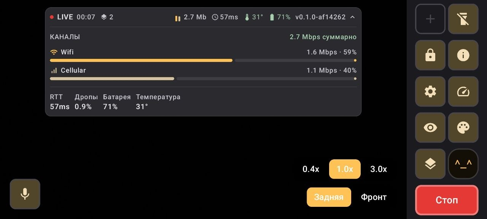
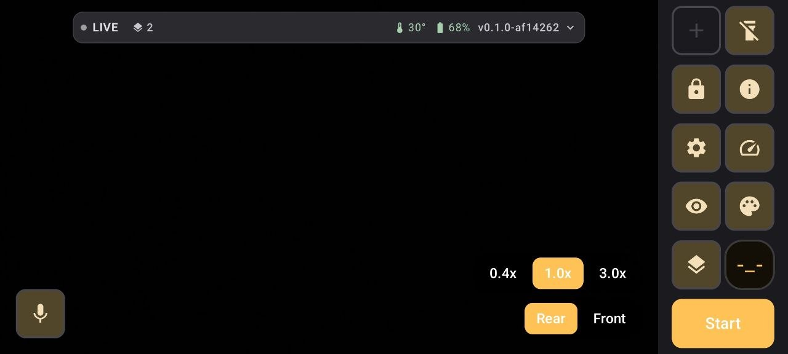
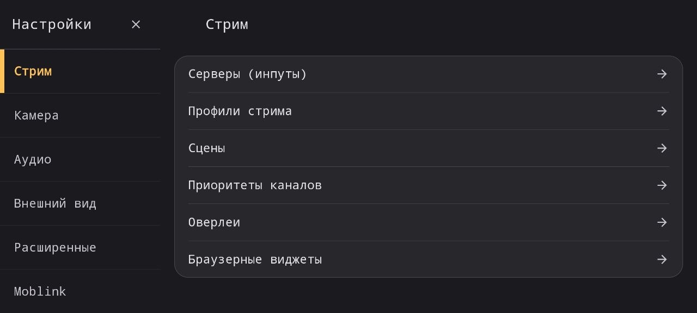

# Brix

**English** · [Русский](README.ru.md)

An Android app for IRL streaming that bonds several network links into one
stream (SRTLA).

An open alternative to the closed IRL apps on Android. For the case where Wi-Fi
reaches the café terrace, cellular covers the street, and the broadcast has to
survive the walk between them.

> **Status: early.** It works and has been tested in the field — but on a single
> device, a Samsung S21 (Exynos 2100, Android 15). Reports from other phones are
> the most valuable thing you can contribute: see [Contributing](#contributing).



*Live, with the HUD expanded: Wi-Fi and cellular carrying 1.6 and 1.1 Mbps of one
2.7 Mbps stream, with RTT, drops, battery and temperature.*

| | |
|---|---|
|  |  |
| Streamer screen with quick buttons | Settings |

## This is a beta

The app works and has been used on air, but this is an early version. What
follows is an honest list of what is untested or limited. It matters more than
the feature list: it tells you what you can rely on and what you cannot yet.

**Field-tested:** SRTLA bonding over Wi-Fi and cellular, RTMP (including
straight to Twitch), adaptive bitrate, scenes, chat, donation overlays, reconnect
after losing a link.

**Untested:**

- **WHIP** — the code is there, but nobody has run it against a live receiver.
- **MP4 recording** — it works, but there have been no long sessions, and
  behaviour on a full disk is unverified.
- **Moblink** (another phone as an extra uplink) — written, but never run with a
  real second device: the author does not have one.
- **Kick and YouTube** — they should behave like Twitch, but were not tried.
- **Any device other than the Samsung S21** (Exynos 2100, Android 15).
  Everything known about this app's behaviour comes from that one phone.

**Limitations worth knowing up front:**

- **Donation overlays support DonationAlerts only.** StreamElements and other
  services are not supported.
- **Constant bitrate (CBR) is unavailable on the S21** — none of its hardware
  encoders advertise it, so the actual bitrate can exceed the target. Other
  devices may differ.
- **Heat.** At 1080p the phone reaches the `critical` thermal state in about six
  minutes. Throttling does not break the stream — verified, zero drops — but the
  body gets hot. This is the hardware, not the app: camera, ISP and encoder take
  over half the power budget.
- **Battery.** Streaming costs 6-10 W, which is one and a half to two and a half
  hours on the internal battery. A power bank is mandatory for long outings.

If any of this breaks for you, an [issue](https://github.com/0rb1ta/Brix/issues)
with your phone model and Android version is worth more than a patch.

## Features

**Transport**

- **SRTLA** — bonds several links (Wi-Fi, cellular, relays) into one stream.
  The SRT and SRTLA client is written from scratch in Kotlin; it is not a
  wrapper around libsrt.
- **RTMP** and **WHIP** for when bonding isn't needed.
- Per-link priorities and weights, reconnect with growing backoff.
- Adaptive bitrate in the BELABOX spirit: mean and minimum RTT, jitter, send
  buffer size, window-forced losses. BELABOX / FAST\_IRL / SLOW\_IRL profiles.

**Video and audio**

- 720p and 1080p, H.264 and HEVC, hardware encoder, encoding profile chosen by
  querying what the particular phone actually supports.
- Scenes: camera, a "be right back" still image, or screen capture. Each scene
  carries its own overlays, camera side and audio mode.
- Lens selection, zoom, torch, tap to focus, optical and electronic
  stabilisation controlled separately, front-camera mirroring set independently
  for the preview and for the stream.
- Microphone capsule selection (including wired, Bluetooth and USB), audio
  processing mode, gain.

**Audience**

- Twitch, Kick and VK Video Live chat in one feed, anonymously, without a
  WebView. Shown to the streamer only — it does not go into the stream.
- DonationAlerts overlays: image and caption rendered natively into the frame,
  with the donation sound optionally mixed into the broadcast.
- Any web page as a source of picture in the frame.

**Also**

- Moblink: another phone contributes its link as an extra uplink.
- MP4 recording alongside the broadcast, from the same encoder.
- Configurable HUD and quick buttons on the streamer screen.
- Session log in CSV — power draw, temperature, thermal status and transport
  figures once per second, for outings where no debugger can be attached.

## Building

Requires JDK 21 and the Android SDK.

```bash
git clone https://github.com/0rb1ta/Brix.git
cd Brix
./gradlew assembleDebug
```

The APK lands in `app/build/outputs/apk/debug/`.

Tests and style check:

```bash
./gradlew testDebugUnitTest ktlintCheck
```

Without a signing key file, release builds are signed with the debug key. That
is deliberate, so the project builds for anyone without secrets. Point
`BRIX_KEYSTORE_PROPERTIES` at your own `keystore.properties`, or drop the file
in the project root — it is never committed.

## Requirements

- Android 10 (API 29) or newer.
- A hardware H.264 or HEVC encoder.
- For bonding, several network interfaces at once (usually Wi-Fi and mobile
  data).
- A receiver that speaks SRTLA — for example
  [bbox-receiver](https://github.com/datagutt/bbox-receiver) on your own server.
  Plain RTMP needs no server of your own; a platform ingest will do.

There is no separate stream key field yet: for RTMP the key goes at the end of
the URL. For Twitch that gives
`rtmp://eun10.contribute.live-video.net/app/YOUR_KEY` — the ingest list lives
[here](https://ingest.twitch.tv/ingests).

## Layout

```
app/         entry point, Activity, packaging
ui/          Compose screens: streamer, settings, chat
streaming/   media path: camera, encoder, scenes, overlays, diagnostics
bonding/     SRT and SRTLA — our own client, no native dependencies
core/        settings model, storage, diagnostics
moblink/     accepting relays from other devices
```

The `bonding` module does not depend on the rest of the app and is usable as a
standalone library.

## Contributing

The most useful thing right now is **reports from other phones**. Everything
known about how this app behaves comes from one Samsung S21, and some of those
conclusions are almost certainly true only for it. For instance: on that device
no hardware encoder supports constant bitrate, and the battery driver reports
current in milliamps instead of the documented microamps.

If you have a different phone, an issue with the model, Android version and what
went wrong is worth more than a patch.

Patches are welcome too. Before sending one, run:

```bash
./gradlew testDebugUnitTest ktlintCheck
```

## Acknowledgements

- [RootEncoder](https://github.com/pedroSG94/RootEncoder) — the media path.
- [BELABOX](https://belabox.net/) — the SRTLA protocol and the receiving side.
- [Moblin](https://github.com/eerimoq/moblin) — the reference for what an IRL
  app should be, and the Moblink protocol.

## Licence

Brix is distributed under the [GNU GPL v3](LICENSE). The code is free to use,
study and modify. All forks and derivative works must stay open under the same
licence.

### The name

**The licence covers the code, not the name.** "Brix", the logo and the mascot
belong to the author and are not part of the freely licensed work.

Fork the project — please do — but under your own name. This is not a
formality: someone downloading "Brix" from elsewhere is entitled to expect it to
be this Brix, and not a third-party build with unknown changes.
