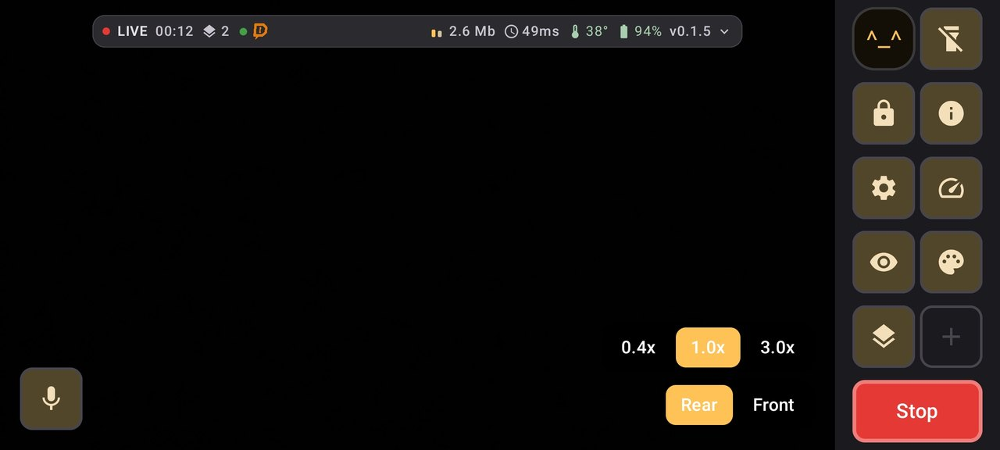

# Brix

[English](README.md) · **Русский**

Приложение для IRL-стриминга с телефона на Android, с объединением нескольких
каналов связи (SRTLA bonding).

Открытая альтернатива закрытым IRL-приложениям под Android. Тот случай, когда
Wi-Fi ловит на веранде кафе, сота — на улице, а трансляция должна пережить
переход между ними, не рассыпавшись.

> **Статус: ранняя версия.** Работает и проверена в поле, но на одном
> устройстве — Samsung S21 (Exynos 2100, Android 15). Отчёты с других телефонов
> очень нужны: см. [Помощь проекту](#помощь-проекту).


*Эфир с раскрытым HUD: Wi-Fi и сота несут 1.6 и 1.1 Мбит/с одного потока в
2.7 Мбит/с, рядом RTT, дропы, заряд и температура.*

| | |
|---|---|
|  |  |
| Экран стримера с быстрыми кнопками | Настройки |

## Это бета

Приложение работает и проверено в эфире, но это ранняя версия. Ниже — честный
список того, что не проверялось или ограничено. Он важнее списка возможностей:
по нему видно, на что можно рассчитывать, а на что пока нет.

**Проверено в поле:** SRTLA с бондингом Wi-Fi и соты, обычный SRT, RTMP (в том
числе прямо на Twitch), адаптивный битрейт, сцены, чат, донат-оверлеи,
переподключение при потере канала.

**Не проверялось:**

- **WHIP** — код есть, но на живом приёмнике его никто не запускал.
- **Запись в MP4** — работает, но длинных сессий не было; поведение при
  заполнении диска не проверено.
- **Moblink** (второй телефон как дополнительный аплинк) — написан, но ни разу
  не запускался с реальным вторым устройством: у автора его просто нет.
- **Kick и YouTube** — должны работать так же, как Twitch, но не проверялись.
- **Любое устройство, кроме Samsung S21** (Exynos 2100, Android 15). Всё, что
  известно о поведении приложения, получено на нём одном.

**Ограничения, про которые лучше знать заранее:**

- **Донат-оверлеи только DonationAlerts.** StreamElements и другие сервисы не
  поддерживаются.
- **Постоянный битрейт (CBR) на S21 недоступен** — ни один аппаратный энкодер
  этого телефона его не заявляет, поэтому фактический битрейт может превышать
  заданный. На других устройствах может быть иначе.
- **Нагрев.** В 1080p телефон доходит до теплового состояния `critical`
  примерно за шесть минут. Троттлинг поток не рвёт — проверено, дропов ноль, —
  но корпус будет горячим. Это свойство железа, а не приложения: камера, ISP и
  энкодер занимают больше половины энергобюджета.
- **Автономность.** Эфир стоит 6–10 Вт, то есть на внутренней батарее это
  полтора-два с половиной часа. Для длинных выездов повербанк обязателен.

Если что-то из этого сломается у вас — [issue](https://github.com/0rb1ta/Brix/issues)
с моделью телефона и версией Android ценнее любой правки кода.

## Что умеет

**Транспорт**

- **SRTLA** — объединение нескольких каналов (Wi-Fi, сота, релеи) в один поток.
  Клиент SRT и SRTLA написан с нуля на Kotlin, это не обёртка над libsrt.
- **Обычный SRT** — для приёмников без SRTLA. Режим выбирается схемой адреса:
  `srtla://` объединяет каналы, `srt://` работает с любым SRT-сервером.
- **RTMP** и **WHIP** — для случаев, когда бондинг не нужен.
- Приоритеты и веса каналов, переподключение с нарастающей паузой.
- Адаптивный битрейт в духе BELABOX: среднее и минимум RTT, джиттер, размер
  буфера отправки, потери по окну. Профили BELABOX / FAST\_IRL / SLOW\_IRL.

**Картинка и звук**

- 720p и 1080p, H.264 и HEVC, аппаратный энкодер, профиль кодирования
  подбирается по возможностям конкретного телефона.
- Сцены: камера, заставка «сейчас вернусь» или захват экрана. У каждой сцены
  свои оверлеи, своя камера и свой режим звука.
- Выбор объектива, зум, фонарик, фокус по тапу, оптическая и электронная
  стабилизация по отдельности, зеркалирование фронталки отдельно для превью и
  для эфира.
- Выбор капсюля микрофона (включая проводной, Bluetooth и USB), режим обработки
  звука, усиление.

**Взаимодействие со зрителем**

- Чат Twitch, Kick и VK Video Live в одной ленте, анонимно, без WebView.
  На экран стримера, в поток не идёт.
- Донат-оверлеи DonationAlerts: картинка и подпись рисуются нативно в кадр,
  звук доната можно подмешать в эфир.
- Произвольная веб-страница как источник картинки в кадре.

**Остальное**

- Moblink: другой телефон отдаёт свой канал как дополнительный аплинк.
- Запись в MP4 параллельно эфиру, тем же энкодером.
- Настраиваемый HUD и быстрые кнопки на экране стримера.
- Журнал сессии в CSV: мощность, температура, тепловой статус и цифры
  транспорта раз в секунду — для выездов, где отладчик не подключить.

## Сборка

Нужны JDK 21 и Android SDK.

```bash
git clone https://github.com/0rb1ta/Brix.git
cd Brix
./gradlew assembleDebug
```

APK появится в `app/build/outputs/apk/debug/`.

Тесты и проверка стиля:

```bash
./gradlew testDebugUnitTest ktlintCheck
```

Релизная сборка без файла с ключами подписывается отладочным ключом — так
сделано намеренно, чтобы сборка проходила у любого без секретов. Свой ключ
подключается через `BRIX_KEYSTORE_PROPERTIES` или файл `keystore.properties`
в корне проекта (в репозиторий он не попадает).

## Требования

- Android 10 (API 29) и выше.
- Аппаратный энкодер H.264 или HEVC.
- Для бондинга — несколько сетевых интерфейсов одновременно (обычно Wi-Fi
  и мобильные данные).
- Для объединения каналов — приёмник с поддержкой SRTLA, например
  [bbox-receiver](https://github.com/datagutt/bbox-receiver) на своём сервере.
  Для обычного SRT подойдёт любой SRT-приёмник (`srt-live-transmit`, SLS, вход
  SRT в OBS), а для RTMP свой сервер не нужен вовсе — подойдёт ингест площадки.

Отдельного поля для ключа трансляции пока нет: у RTMP ключ дописывается в конец
адреса. Для Twitch получается
`rtmp://eun10.contribute.live-video.net/app/ВАШ_КЛЮЧ` — список ингестов есть
[здесь](https://ingest.twitch.tv/ingests).

## Устройство проекта

```
app/         точка входа, Activity, сборка
ui/          экраны на Compose: стример, настройки, чат
streaming/   медиа-тракт: камера, энкодер, сцены, оверлеи, диагностика
bonding/     SRT и SRTLA — свой клиент, без нативных зависимостей
core/        модель настроек, хранение, диагностика
moblink/     приём релеев с других устройств
```

Модуль `bonding` не зависит от остального приложения и в принципе пригоден
как отдельная библиотека.

## Помощь проекту

Самое полезное прямо сейчас — **отчёты с других телефонов**. Всё, что известно
о поведении приложения, получено на одном Samsung S21, и часть выводов почти
наверняка верна только для него. Например: на этом устройстве ни один аппаратный
энкодер не поддерживает постоянный битрейт, а драйвер батареи отдаёт ток в
миллиамперах вместо задокументированных микроампер.

Если у вас другой телефон — issue с моделью, версией Android и описанием того,
что пошло не так, ценнее любой правки кода.

Правки тоже приветствуются. Перед отправкой прогоните:

```bash
./gradlew testDebugUnitTest ktlintCheck
```

## Благодарности

- [RootEncoder](https://github.com/pedroSG94/RootEncoder) — медиа-тракт.
- [BELABOX](https://belabox.net/) — протокол SRTLA и приёмная сторона.
- [Moblin](https://github.com/eerimoq/moblin) — образец того, каким должно быть
  IRL-приложение, и протокол Moblink.

## Лицензия

Проект Brix распространяется под лицензией [GNU GPL v3](LICENSE). Код свободен
для использования, изучения и модификации. Все форки и производные работы
обязаны оставаться открытыми под той же лицензией.

### Название

**Лицензия распространяется на код, но не на название.** «Brix», логотип и
маскот остаются за автором и в состав свободно лицензируемой работы не входят.

Форкать проект можно и нужно — но под своим именем. Это не формальность:
пользователь, скачавший «Brix» из стороннего источника, вправе рассчитывать,
что это тот самый Brix, а не чужая сборка с неизвестными изменениями.
